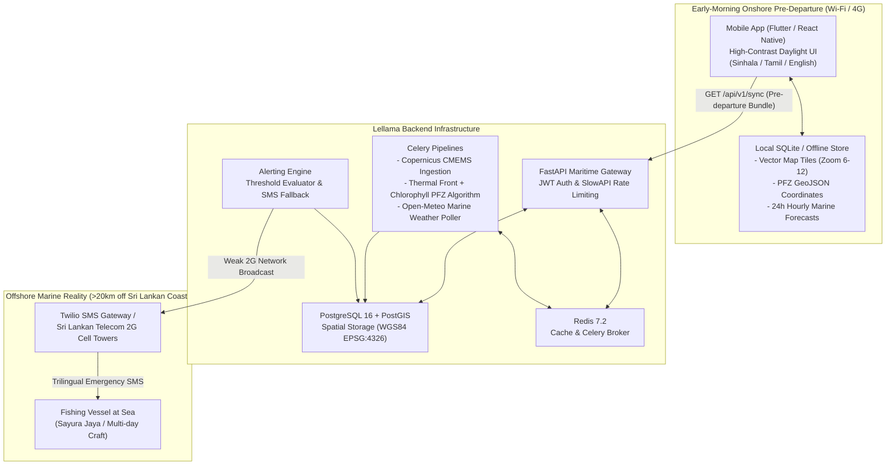

# LELLAMA (ලෙල්ලම / லெல்லம) — Sri Lanka Marine PFZ & Safety Platform

[](LICENSE)
[](https://fastapi.tiangolo.com)
[](https://postgis.net)
[](https://flutter.dev)
[]()
[]()

> **Mission-critical, offline-first marine intelligence and safety platform engineered for Sri Lankan artisanal and multiday offshore fishermen.**

---

## 1. Executive Summary

Off the coast of Sri Lanka, artisanal and multiday fishing vessels routinely venture 20km to 150km beyond territorial waters into the Exclusive Economic Zone (EEZ). In these zones, high-speed cellular coverage (4G/LTE) diminishes completely.

**LELLAMA** solves two foundational challenges:
1. **Fuel-Efficient Fishing:** Daily thermal front detection and chlorophyll-a concentrations (Copernicus Marine / CMEMS) pinpoint **Potential Fishing Zones (PFZs)** to slash fuel consumption and transit time.
2. **Offshore Life Safety:** Real-time wave dynamics (Open-Meteo Marine) identify squalls and dangerous sea states (>2.5m swells), delivering push alerts onshore and failing over to **2G SMS broadcasts** when vessels are offshore.

---

## 2. System Architecture



---

## 3. Database Schema (Phase 1)

All spatial geometries are indexed and projected in **WGS84 (EPSG:4326)** covering the Sri Lankan Exclusive Economic Zone (4.5°N - 10.5°N, 78.5°E - 83.5°E):

| Table | Purpose | Key Attributes & Spatial Fields |
| :--- | :--- | :--- |
| `users` | Fishermen, captains, and maritime authorities | `id` (UUID), `phone_number` (E.164 e.g. `+9477...`), `language_preference` (`si`/`ta`/`en`), `role` (`fisher`/`captain`/`coastguard`/`admin`) |
| `vessels` | Multi-day and dayboat vessel registration | `registration_number` (e.g. `IMUL-A-0982-KLT`), `home_port`, `harbor_latitude`, `harbor_longitude`, `last_known_latitude`, `last_known_longitude`, `last_ping_time` |
| `pfz_coordinates` | Detected Potential Fishing Zones | `detection_date`, `latitude`, `longitude`, `sst_value` (°C), `sst_gradient` (°C/km), `chlorophyll_value` (mg/m³), `confidence_score` (0.0 - 1.0) |
| `weather_caches` | Hourly ocean wave and current forecasts | `forecast_timestamp`, `valid_for_time`, `wave_height` (m), `wave_direction` (°), `wind_wave_height` (m), `swell_wave_height` (m), `ocean_current_velocity` (m/s) |
| `alert_logs` | Trilingual safety warning audit trail | `alert_level` (`advisory`/`warning`/`danger`), `channel` (`push`/`sms`/`hybrid`), `message_sinhala`, `message_tamil`, `message_english`, `delivery_status` |

---

## 4. API Endpoints Specification

All endpoints are mounted under `/api/v1` and protected with JWT Bearer authentication:

* **Authentication (`/api/v1/auth`)**
  * `POST /register` — Register user with E.164 Sri Lankan phone validation (`+947...`) and bcrypt hashing.
  * `POST /login` — Authenticate using phone number or email; issues JWT with 24-hour offshore validity.
  * `GET /me` — Retrieve sanitized active profile.
* **Vessels (`/api/v1/vessels`)**
  * `POST /` — Register fishing vessel with harbor coordinates.
  * `GET /` — List registered vessels under authenticated account.
  * `POST /{vessel_id}/ping` — Record offshore GPS coordinates and update ping telemetry.
* **Potential Fishing Zones (`/api/v1/pfz`)**
  * `GET /` — List active PFZs filtered by date and confidence threshold.
  * `GET /geojson` — RFC 7946 compliant GeoJSON FeatureCollection formatted for direct vector rendering.
* **Marine Weather (`/api/v1/weather`)**
  * `GET /point` — Retrieve 24-48 hour hourly forecast series for a specific coordinate or harbor.
* **Offline Sync Engine (`/api/v1/sync`)**
  * `GET /` — Bundle active PFZ GeoJSON, 24-hour weather forecasts (for home port and top PFZs), active alerts, and map tile caching manifests in a single payload.

---

## 5. Development & Deployment Setup

### Prerequisites
- Python 3.11+
- Docker & Docker Compose
- PostgreSQL 16 with PostGIS extension (or Docker container)
- Redis 7.2 (or Docker container)

### Quick Start (Local Development)

```bash
# 1. Clone repository and navigate to backend
cd backend

# 2. Initialize Python virtual environment
python3 -m venv .venv
source .venv/bin/activate

# 3. Install production and test dependencies
pip install -r requirements.txt

# 4. Configure environment
cp .env.example .env

# 5. Run test suite
pytest -v
```

### Mobile Client (Flutter Application)

The mobile client is engineered for extreme tropical maritime conditions, low-connectivity offline caching, and high-glare sunlight visibility:

```bash
# 1. Navigate to mobile directory
cd mobile

# 2. Fetch packages
flutter pub get

# 3. Execute mobile test suite (unit + widget)
flutter test

# 4. Run static analysis
flutter analyze

# 5. Launch application on target device / emulator
flutter run
```

### Docker Compose Full Stack Deployment

```bash
# Launch PostGIS, Redis, FastAPI Backend, and Celery pipelines
docker compose up -d --build

# Inspect running containers
docker compose ps

# Access interactive Swagger API documentation
open http://localhost:8000/api/v1/docs
```

---

## 6. Verification & Quality Assurance

Both the backend distributed pipeline and the mobile Flutter client maintain 100% test passing rates with strict linting:

### Backend Test Suite (Pytest: 24 Passed)
```
tests/test_alert_engine.py::test_onshore_vessel_receives_push_notification PASSED [  4%]
tests/test_alert_engine.py::test_offshore_offline_vessel_escalates_to_sms_fallback PASSED [  8%]
tests/test_alert_engine.py::test_safety_evaluator_triggers_and_deduplicates_alerts PASSED [ 12%]
tests/test_alert_engine.py::test_celery_safety_evaluation_task PASSED    [ 16%]
tests/test_auth.py::test_register_fisherman_success PASSED               [ 20%]
tests/test_auth.py::test_register_duplicate_phone_rejected PASSED        [ 25%]
tests/test_auth.py::test_login_with_phone_number PASSED                  [ 29%]
tests/test_auth.py::test_login_with_email PASSED                         [ 33%]
tests/test_auth.py::test_login_invalid_password PASSED                   [ 37%]
tests/test_auth.py::test_get_current_user_profile PASSED                 [ 41%]
tests/test_auth.py::test_get_current_user_unauthorized_without_token PASSED [ 45%]
tests/test_pfz_algorithm.py::test_pfz_detector_extracts_thermal_fronts PASSED [ 50%]
tests/test_pfz_algorithm.py::test_pfz_detector_geojson_conversion PASSED [ 54%]
tests/test_pfz_and_weather.py::test_pfz_geojson_export PASSED            [ 58%]
tests/test_pfz_and_weather.py::test_weather_cache_and_point_query PASSED [ 62%]
tests/test_pipeline_tasks.py::test_copernicus_pfz_pipeline_execution PASSED [ 66%]
tests/test_pipeline_tasks.py::test_marine_weather_ingestion_pipeline_execution PASSED [ 70%]
tests/test_rate_limiter.py::test_rate_limiter_allows_normal_traffic PASSED [ 75%]
tests/test_sync.py::test_download_offline_sync_bundle PASSED             [ 79%]
tests/test_vessels.py::test_register_vessel PASSED                       [ 83%]
tests/test_vessels.py::test_list_user_vessels PASSED                     [ 87%]
tests/test_vessels.py::test_ping_vessel_offshore_location PASSED         [ 91%]
tests/test_weather_providers.py::test_weather_service_automated_failover PASSED [ 95%]
tests/test_weather_providers.py::test_weather_service_raises_when_all_providers_fail PASSED [100%]

======================= 24 passed, 4 warnings in 48.83s ========================
```

### Mobile Test Suite (Flutter: 2 Passed, 0 Analyzer Issues)
```
00:00 +0: Great-circle navigation distance and bearing calculation
00:00 +1: Lellama Marine App renders daylight UI and language controls
00:01 +2: All tests passed!

$ flutter analyze
Analyzing mobile...
No issues found! (ran in 1.2s)
```

---

## 7. Future Work & Production Telecom Integrations

> [!IMPORTANT]
> **Production Gateway Transition Plan**
> In accordance with development protocols, mock implementations have been provided for SMS fallback and Push notification dispatch during testing and offline development. The codebase is architected with complete interface/adapter isolation to enable zero-code-change credential injection for production rollout:

1. **Twilio SMS Gateway Deployment:**
   - Populate `TWILIO_ACCOUNT_SID`, `TWILIO_AUTH_TOKEN`, and `TWILIO_PHONE_NUMBER` in `backend/.env`.
   - The [`SMSFallbackClient`](file:///home/kisalnelaka/Work/lellama/backend/app/services/alert_dispatcher.py) will automatically switch from internal audit logging to live telecommunications dispatch.
2. **Direct Sri Lankan Telecom Integrations:**
   - Integrate native Dialog Axiata (Ideamart / IDEA Pro) and SLT-Mobitel (mConnect) direct SMPP/HTTP SMS gateways for high-priority cell tower coastal propagation over the 900MHz band (which penetrates significantly farther offshore than higher LTE frequencies).
3. **Apple APNs / Google Firebase Cloud Messaging (FCM):**
   - Populate `FCM_SERVER_KEY` to activate production background push wakeups for early morning forecast caching before fishermen cast off.
4. **VHF Marine Radio Broadcast Bridge:**
   - Automated text-to-speech conversion of trilingual warning payloads for automated broadcast over VHF marine radio channels 16 and 68 via Sri Lanka Coast Guard radio stations (Colombo Radio / Galle Port Control).

